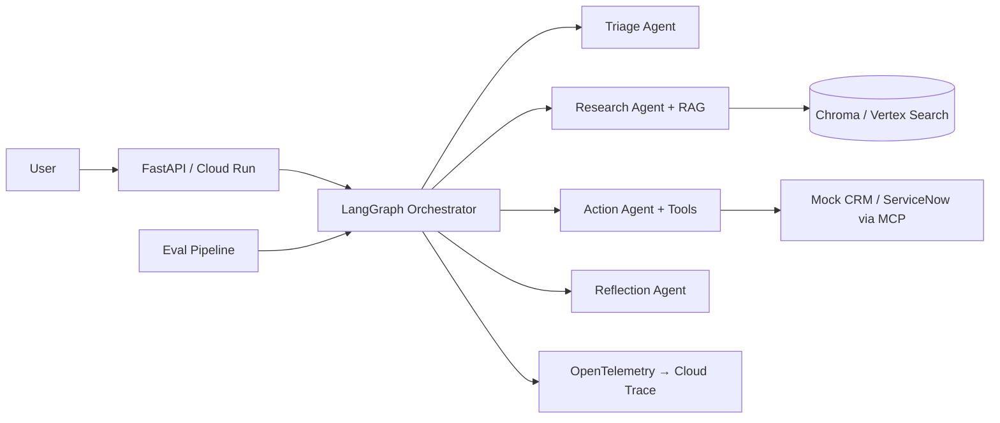

# FieldOps Agent Fabric

**A production-shaped reference implementation for enterprise support automation** — the kind of system a Google Cloud Forward Deployed Engineer (FDE) prototypes with a customer and hardens for production.

> *Scenario:* A B2B SaaS company needs an AI copilot that triages support requests, grounds answers in internal policy (RAG), acts on legacy CRM/ticketing APIs, and ships with evaluation + observability suitable for security review.

[](https://github.com/YOUR_USERNAME/fieldops-agent-fabric/actions)

## Why this maps to the FDE role

| Job requirement | How this repo demonstrates it |
|-----------------|-------------------------------|
| Applied AI around pretrained models | RAG over policy docs, structured prompts, reflection gate |
| Multi-agent / ReAct / delegation | LangGraph workflow: triage → research → action → reflection |
| MCP & tool orchestration | `mcp_servers/enterprise_mock` exposes CRM/ticketing tools |
| GCP deployment | Terraform for Cloud Run, Vertex AI provider, Cloud Trace export |
| Eval + observability | Golden-set eval CLI, token/cost/latency metrics, OpenTelemetry spans |
| Google ADK (preferred) | `src/fieldops/agents/adk_example.py` — ADK deployment path |
| Production friction | Mock mode for CI, Docker, HITL-ready ticket creation, audit trails on tools |

## Architecture



## Quick start (no cloud credentials)

```bash
git clone https://github.com/YOUR_USERNAME/fieldops-agent-fabric.git
cd fieldops-agent-fabric
python -m venv .venv && source .venv/bin/activate
pip install -e ".[dev,gcp]"   # Python 3.11+

cp .env.example .env   # LLM_PROVIDER=mock
make ingest && make test && make eval
make api               # http://localhost:8080/docs
```

Example request:

```bash
curl -s -X POST http://localhost:8080/v1/support \
  -H 'Content-Type: application/json' \
  -d '{"query":"Enterprise customer reports us-central1 outage affecting payments","customer_id":"cust-1001"}' | jq
```

## Vertex AI path (recommended for interviews)

```bash
export LLM_PROVIDER=vertex
export GOOGLE_CLOUD_PROJECT=your-project
export GOOGLE_CLOUD_REGION=us-central1
gcloud auth application-default login
make ingest && make eval
```

## ADK deployment path

Google's [Agent Development Kit](https://google.github.io/adk-docs/) is the preferred stack for GCP-native agents. This repo includes `adk_example.py` as the starting point for:

- Wiring MCP tools from `mcp_servers/enterprise_mock`
- Deploying to **Cloud Run** or **Vertex AI Agent Engine**
- Human-in-the-loop tool confirmation (extend `create_ticket` with approval)

## ROI narrative (put this in your README / resume)

Use metrics from `make eval` and live `/v1/support` responses:

- **Automation rate:** % of golden cases passing without human edit
- **Cost per resolved case:** `estimated_cost_usd` from metrics
- **Latency:** `total_latency_ms`, **throughput:** `tokens_per_second`
- **Time saved:** (baseline handle time − agent handle time) × volume

Example one-liner for applications:

> *Built a multi-agent support fabric on GCP with RAG + MCP integrations; golden-set eval hit 100% pass@category with &lt;$0.01 mock cost per case and full OTel traces for production readiness.*

## Repository layout

```
src/fieldops/          # Application code
  agents/              # LangGraph + ADK example
  rag/                 # Ingest + Chroma retriever
  tools/               # Enterprise API shims
  observability/       # Metrics + tracing
  api/                 # FastAPI (Cloud Run entry)
  eval/                # Golden-set runner
mcp_servers/           # MCP "connective tissue"
data/                  # Policies + eval set
infra/terraform/       # Cloud Run sketch
```

## Deploy to Cloud Run (outline)

```bash
gcloud builds submit --tag REGION-docker.pkg.dev/PROJECT/fieldops-agent-fabric/api:latest
cd infra/terraform && terraform init && terraform apply -var="project_id=PROJECT"
```

## What to build next (1–2 weekends — high signal)

1. **Vertex AI Search** instead of Chroma for the RAG layer
2. **ADK agent** fully replacing LangGraph on a feature branch
3. **BigQuery sink** for eval metrics + Looker Studio dashboard screenshot
4. **Safety evals:** jailbreak set + refusal rate
5. **2-min Loom demo** walking triage → ticket → trace in Cloud Console

## License

Apache-2.0
